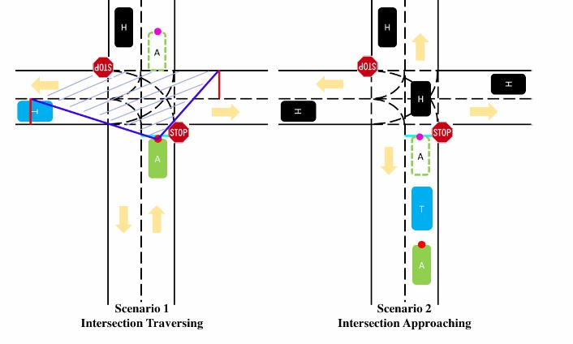
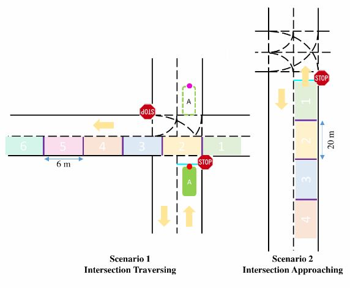
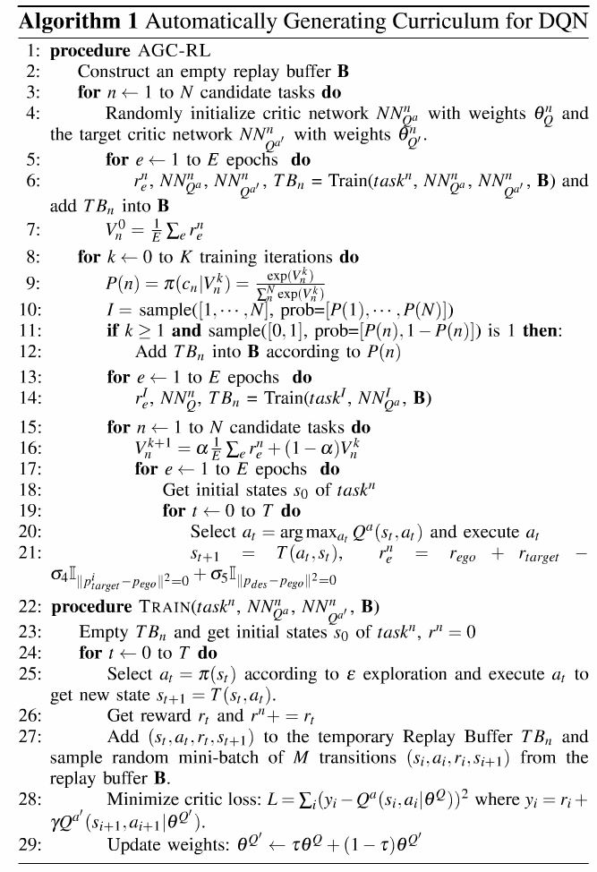
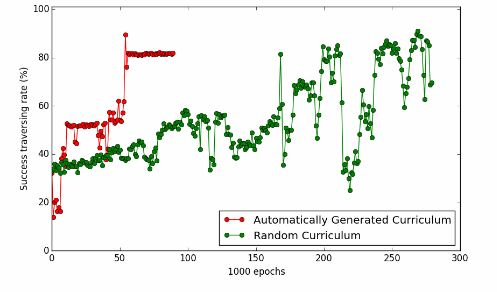

#DRL-AutomatedDriving
______
       基于深度强化学习的课程学习算法的自动驾驶训练模型
______

1. 建立两个场景如上图所示

    * Scenario1：Target Vehicle（非自动驾驶车辆）匀速通过十字交叉路口，Automatic Vehicle(自动驾驶车辆)初始位置停在停止线。
    * Scenario2：目标车辆与自动驾驶车辆行驶在同一条车道上，目标车辆匀速行驶，自动驾驶车辆跟随着目标车辆。

2. 设置环境
    
    * 车辆控制环境使用**马尔科夫决策过程(MDP)**算法，即由当前的状态St与动作a,通过MDP算法获得下一状态St+1。
     
3. 回报（Reward）函数
    * AV车辆随着时间移动,行驶路程越远，获得的惩罚回报越大；
    * AV车辆跟随TV车辆距离越近，获得的惩罚回报越大；
    * 如果两车发生碰撞，获得一个惩罚回报；
    * 如果在规定时间内，没有通过交叉路口，获得一个惩罚回报；
    * 对于第二个场景，如果没有AV车辆没有在停止线停止，获得一个惩罚回报；
    * 如果在规定时间内到达目的地，获得一个收益回报。
   
4. 模型训练过程
    * 通过MDP算法建立好两个场景环境，我们的目标是为了学习一种策略Π使得获得期望累加回报最大，
    使用了基于深度强化学习**Deep Deterministic Policy Gredient,DDPG**去学习最优策略.
    * 我们将场景分成6个Tasks（如下图所示）:
    
    考虑到长时间的训练过程，我们采用了自动课程学习算法的课程学习**Automatically Generated Curriculum, AGC**
    首先将相对较容易的Task选择出来放入智能体（Agent）中去训练，然后逐渐增加Task的困难程度，继续训练。
    * 完整的算法实现过程（如Algorithm1所示）以及代码实现（附件Target_Ego_MDP.py; AGC_DDPG.py）:
    

5. 训练结果

    * 采用了两种训练策略做对比：1.基于深度强化学习的随机课程学习(Random Curriculum, RC)；2.基于深度强化学习的自动课程学习（AGC）。
    对于每个epoch, 一个成功事件意味着两车之间没有发生碰撞或者AV车辆成功完成整个过程。大概在50000个Epochs后，采用AGC的DRL
    成功率达到了80%，并且成功率趋于稳定。而采用RC的DRL训练1700000个Epochs后才能达到80%的成功率，并且随着Epochs训练次数增大，成功率曲线不稳定（训练结果如下图所示）。

- 此项目算法基于论文：Automatically Generated Curriculum based Reinforcement Learning for Autonomous Vehicles in Urban Environment
       

    
